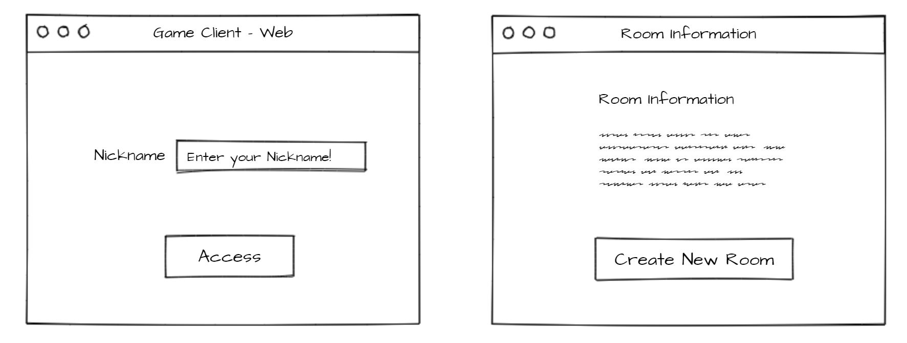

# GameServerWithAzFunc

## Objective 
(ENG) The objective of this project is create a simple game server in various runtime and compare the performance between them and manage the server by using Azure Function. There is a list of runtime what we will use on this project.  

(KOR) 이 프로젝트의 목적은 간단한 형태의 게임서버를 다양한 런타임에서 구축해보고 각각의 성능을 비교해보고, 이를 Serverless 서비스인 Azure Functions 를 사용해서 서비스를 배포 및 운영해보려고 합니다. 
게임서버로 사용할 런타임의 목록은 다음과 같습니다. 

1. .NET Core - WebSocket, pure TCP Socket
2. .NET Framework + Super Socket - WebSocket, pure TCP Socket
3. SignalR - WebSocket
4. Nodejs - WebSocket, pure TCP Socket

> WebSocket is basically an application protocol (with reference to the ISO/OSI network stack), message-oriented, which makes use of TCP as transport layer. The idea behind the WebSocket protocol consists of reusing the established TCP connection between a Client and Server. [(Link)](https://code.i-harness.com/en/q/10290c1)

## Tools & Services
* Code repo & Project Management: Github
* IDE : Visual Studio, VS Code
* Cloud Service: Azure VM, Azure Functions, Azure Storage ...

## Description
### Server Side
1. Requirements
    * When a client request connection, if there is no room, create a room for the client
    * All the messages in the same room, should broadcast to all the clients in the same room
    * Benchmark test and Logging should be considered   
    * Use [Message Pack](https://msgpack.org/) for serialization 

### Client Side
1. Web Browser

2. Unity

### Azure Functions

1. User Authentication

    : When user enter their nickname, create GUID for identification purpose and return GUID and manage session information by using cache service such as [Azure Cache for Redis](https://azure.microsoft.com/ko-kr/services/cache/)
2. Room Creation
    
    : If the room is reaching the limit, create a new VM using snap shot image from current server. This will be changed to use Kubernetes on next sprint.

## Useful Links and Tools
* WebSocket test tool : [https://www.websocket.org/echo.html](https://www.websocket.org/echo.html)
* [Create a websocket server in .net core console application](https://stackoverflow.com/questions/48342919/create-a-websocket-server-in-net-core-console-application)
