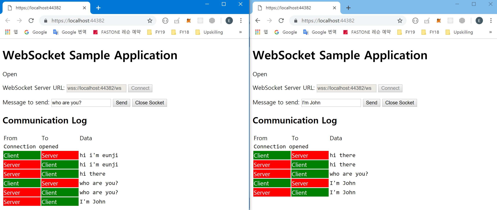

# WebSocketServer
Server handles clients request using WebSocket

## How it works?

When the Server receives a message from a client, it broadcasts the message to all connected clients.

## Code
This project refers to the [following link](https://docs.microsoft.com/ko-kr/aspnet/core/fundamentals/websockets?view=aspnetcore-2.2) from Microsoft Official repo. 

```
ConcurrentDictionary<string, WebSocket> connectionList = new ConcurrentDictionary<string, WebSocket>();
```
This is a dictionary for managing websocket list

```
while(!result.CloseStatus.HasValue)
{
    // Broadcast message to all the connected sockets
    foreach (KeyValuePair<string, WebSocket> pair in connectionList)
    {
        await pair.Value.SendAsync(new ArraySegment<byte>(buffer, 0, result.Count), result.MessageType, result.EndOfMessage, CancellationToken.None);
    }
    result = await webSocket.ReceiveAsync(new ArraySegment<byte>(buffer), CancellationToken.None);
}
```
While the socket is connected status, broadcast a message to all connected sockets

```
// delete the closed socket on the dictionary
if(result.CloseStatus.HasValue)
{
    var deletedSocket = connectionList.First(key => key.Value == webSocket);
    connectionList.TryRemove(deletedSocket.Key, out webSocket);
}
```
If the socket is closed, delete the socket from the dictionary. 

## Reference
* [ASP.NET Core for Absolute Beginner](https://www.youtube.com/watch?v=xc3Gl4rnWV4)
* [https://docs.microsoft.com/ko-kr/dotnet/api/system.net.websockets.websocket?view=netframework-4.7.2](https://docs.microsoft.com/ko-kr/dotnet/api/system.net.websockets.websocket?view=netframework-4.7.2)
* [ConcurrentDictionary 기본 사용법](http://mongyang.tistory.com/116)